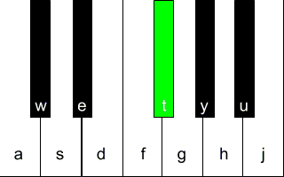

# absolute-pitch-trainer

> **Absolute pitch** (**AP**), often called **perfect pitch**, is the ability to identify or re-create a given musical note without the benefit of a reference tone.

A perfect pitch trainer, fully written in Assembly. It plays a note, lets the user guess its keyboard key, and provides feedback on correctness, repeating in a loop.
It looks like this:

Absolute pitch is not a prerequisite for skilled musical performance or composition.
However, musicians with absolute pitch tend to perform better on musical transcription tasks compared to those without absolute pitch.

## Nature vs Nurture

Absolute pitch might be achievable by any human being during a critical period of auditory development, after which period cognitive strategies favor global and relational processing. The critical-period theory supports that learning is crucial for developing absolute pitch, but there is debate on whether specific training fosters these skills or if a lack of training leads to dominance of relative perception.
This project, a game designed to practice absolute and relative pitch, is particularly relevant for music educators, students, and enthusiasts. It leverages the critical period of auditory development to nurture the ability for absolute pitch while also enhancing relative pitch skills, potentially offering a balanced approach to musical ear training.

## 100% Assembly

It's uncommon to find applications entirely written in Assembly.
This project was developed in Assembly to facilitate learning the language.
To simplify understanding, it has been deliberately kept in a single file, reducing the complexity of navigating through multiple files.
